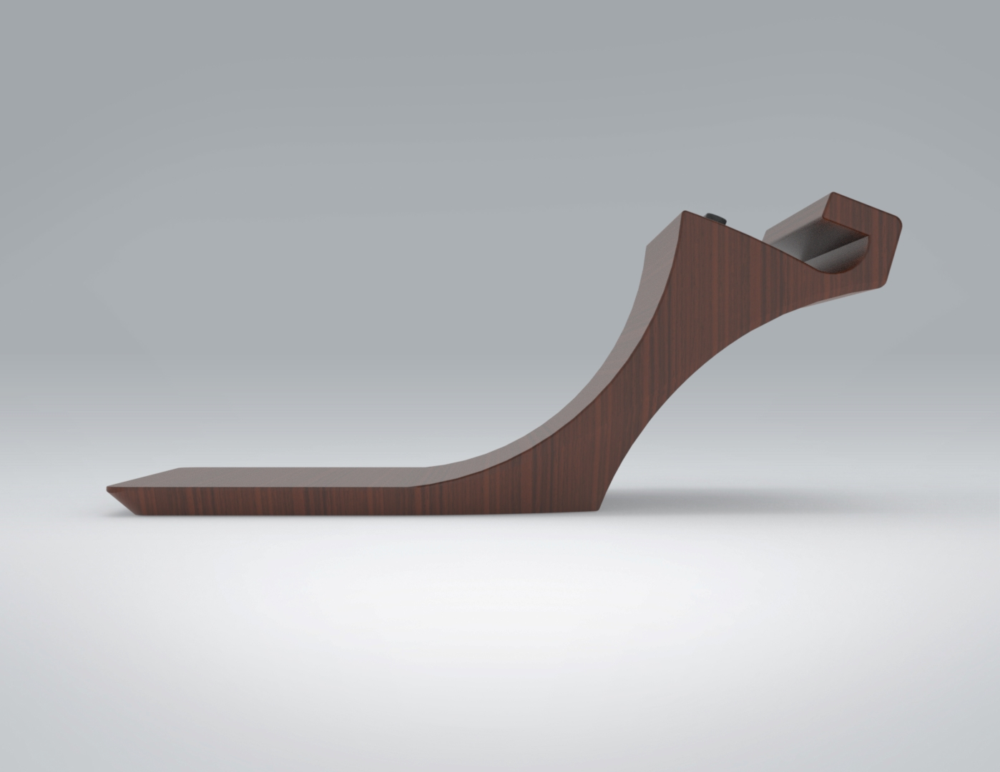
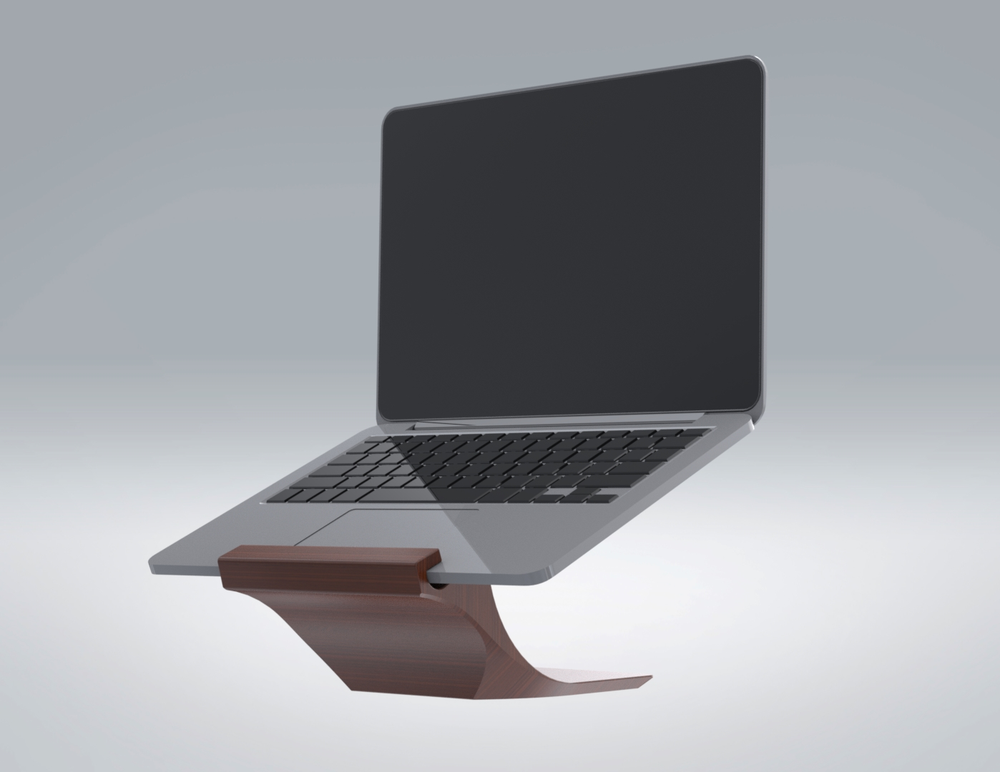
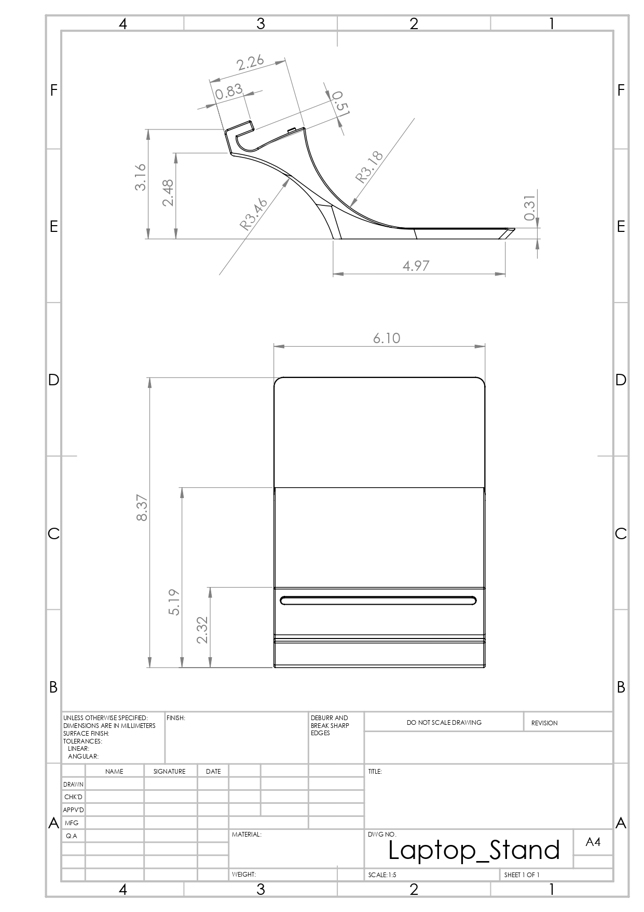
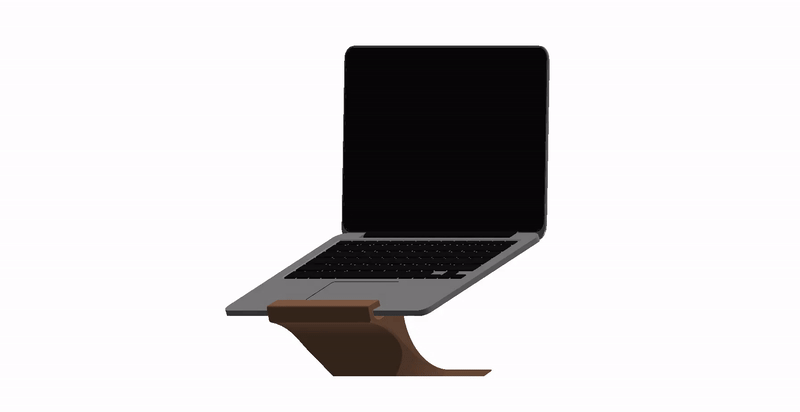
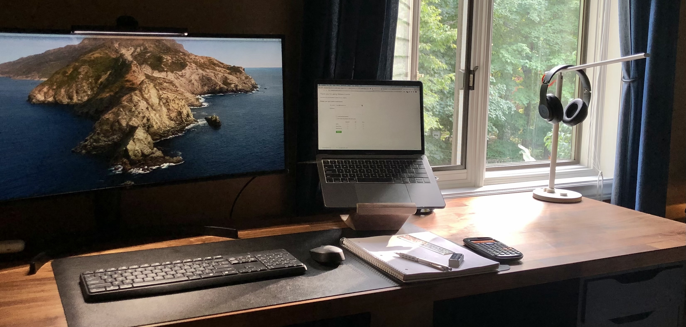

    
    

# DIY Laptop Stand

### Design Considerations
- Maximize ventilation
- Screen elevation
- Minimalist Aesthetic

### The Prototype:

    

    

### Planning:

**a. Materials:**
   - 10” x 4” x 15" block of wood of choice (walnut)
   - Rubber bumper strip
2. Tools/Equipment
   - Band saw
   - Scroll Saw
   - Sander
   - Sandpaper
   - Router

### Fabrication
Steps
   - Create a stencil of the side profile
   - Trace the stencil on the block of wood
   - Cut out the profile
       - Band Saw
       - Scroll Saw 
       - Router
    - Finish
        - Sanding
        - Varnish

### Final Product:

---

MacBook model: [GrabCAD Model](https://grabcad.com/library/laptop-stand-40)  
Credits to [YOHANN](https://www.yohann.com/) for design inspiration.
